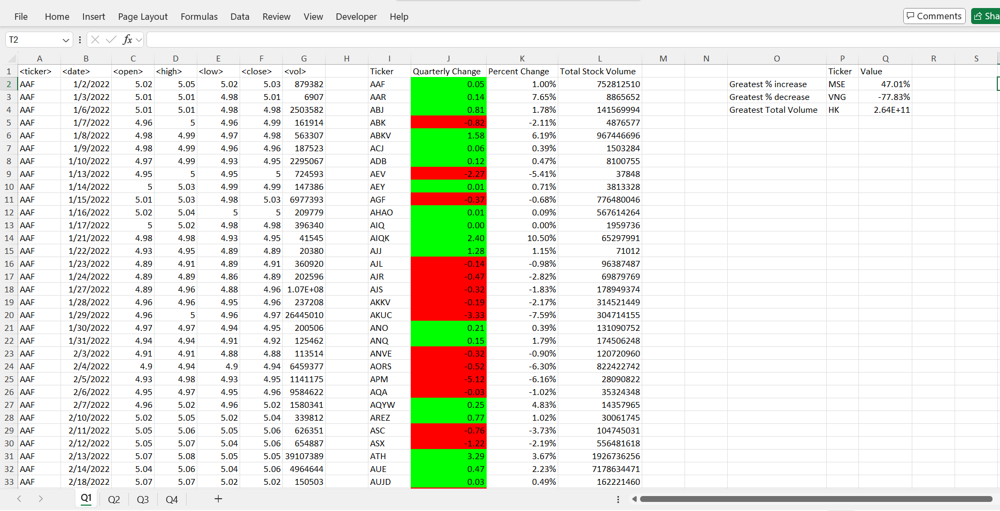
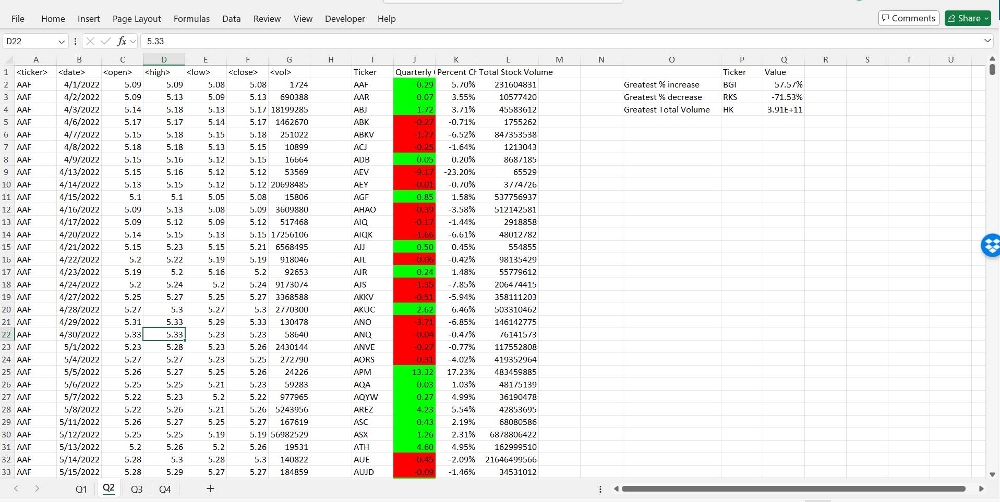
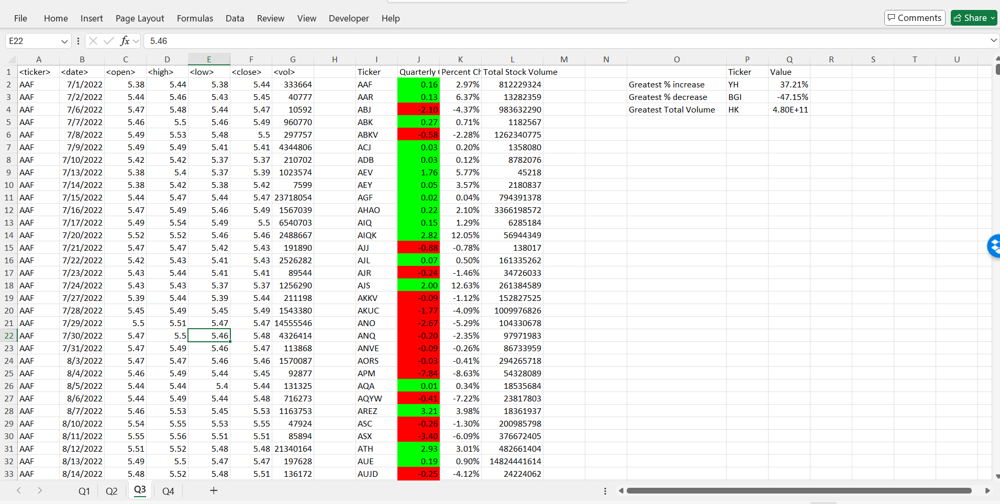
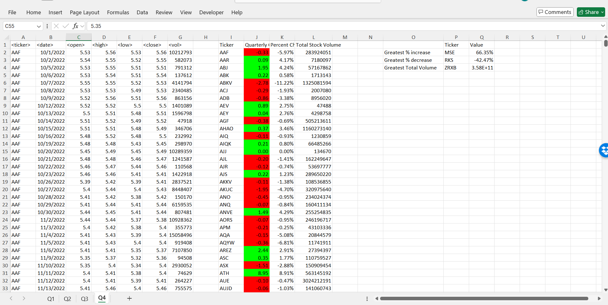

# VBA_Challenge

## Stock Analysis using VBA

This repository contains the code and resources for performing a stock analysis using Visual Basic for Applications (VBA). The project is part of an assignment that involves analyzing stock market data to provide insights such as Quarterly stock performance and total volume traded. Two summary tables 

## Project Structure

- `Multiple_year_stock_data.xlsm` and `Multiple_year_stock_data_ver2.xlsm`: The Excel workbooks that contains the stock data and the VBA codes to analyze it. ver1 is the final complete version.
- `alphabetical_testing.xlsm` and `alphabetical_testing_ver2.xlsm`: The Excel workbooks to test the itermediate and final codes
- `README.md`: This file, providing an overview of the project.
- `images/`: Directory containing screenshots of the Excel workbook or output (optional).

## Objective

The main objective of this assignment is to:

1. Analyze stock performance for each ticker symbol.
2. Calculate Quarterly change in stock price for each ticker.
3. Determine the percentage change in stock price.
4. Calculate total volume traded for each stock in the given Quarter.
5. The VBA process 

## VBA Features Used

- Loops (`For` and `For Each`) to iterate over rows of stock data.
- Conditional Statements (`If/Else`) to perform calculations such as identifying Quarterly changes.
- Data storage using arrays and variables for optimizing memory usage.
- Formatting cells using VBA to highlight results (positive/negative change).

### How the Code Works

- The VBA code reads through stock data and identifies the opening and closing prices for each stock for the given Quarter.
- It then computes the Quarterly change, percentage change, and total volume for each stock.
- The results are output in a neatly formatted table in the worksheet, with conditional formatting applied for visual clarity.
- Functionality to return the stock with the "Greatest % increase", "Greatest % decrease", and "Greatest total volume" per Quarter was also added.

## Example Output

## Q1 Results

## Q2 Results

## Q3 Results

## Q4 Results

### End of Report
